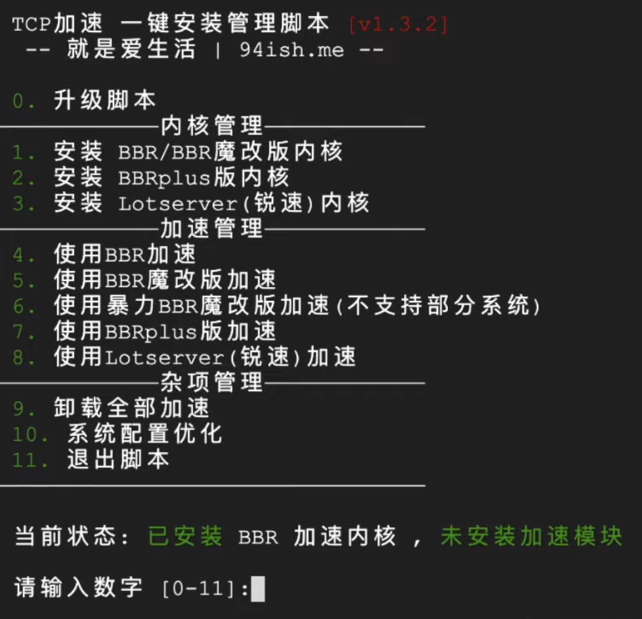
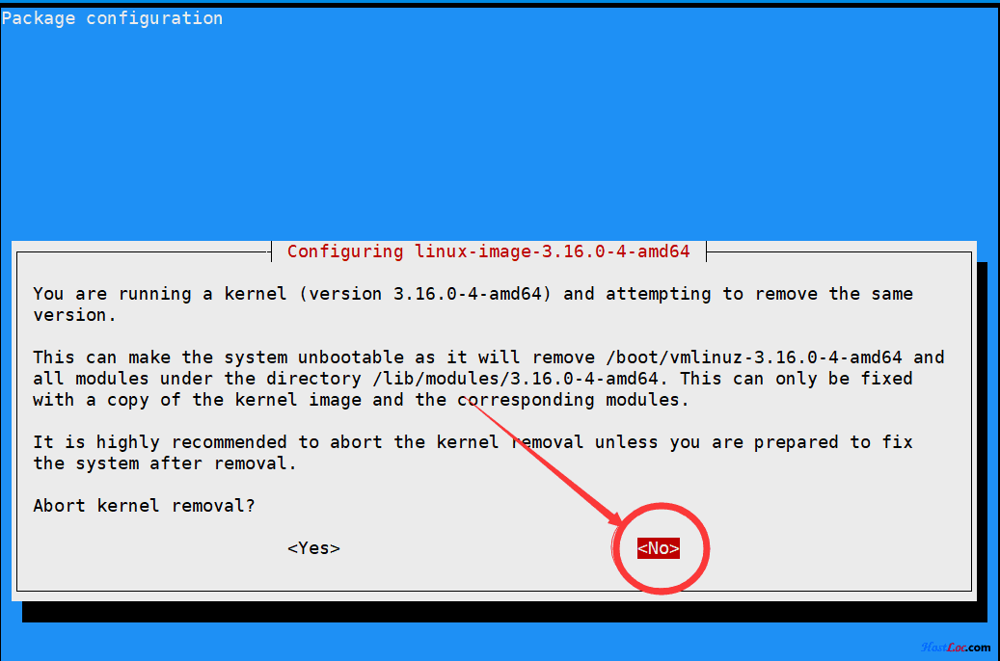

# Linux-NetSpeed
```
wget -N --no-check-certificate "https://raw.githubusercontent.com/kang-mk/Linux-NetSpeed/master/tcp.sh"
chmod +x tcp.sh
./tcp.sh
```


脚本说明  
支持系统  
Centos 6+ / Debian 7+ / Ubuntu 14+  
BBR魔改版不支持Debian 8  



如果在删除内核环节出现这样一张图  



注意选择NO  

根据自己需求操作，重启后再使用./tcp.sh命令接着操作  

脚本会自动检测安装的情况，请注意脚本菜单下的状态检测即可。  
